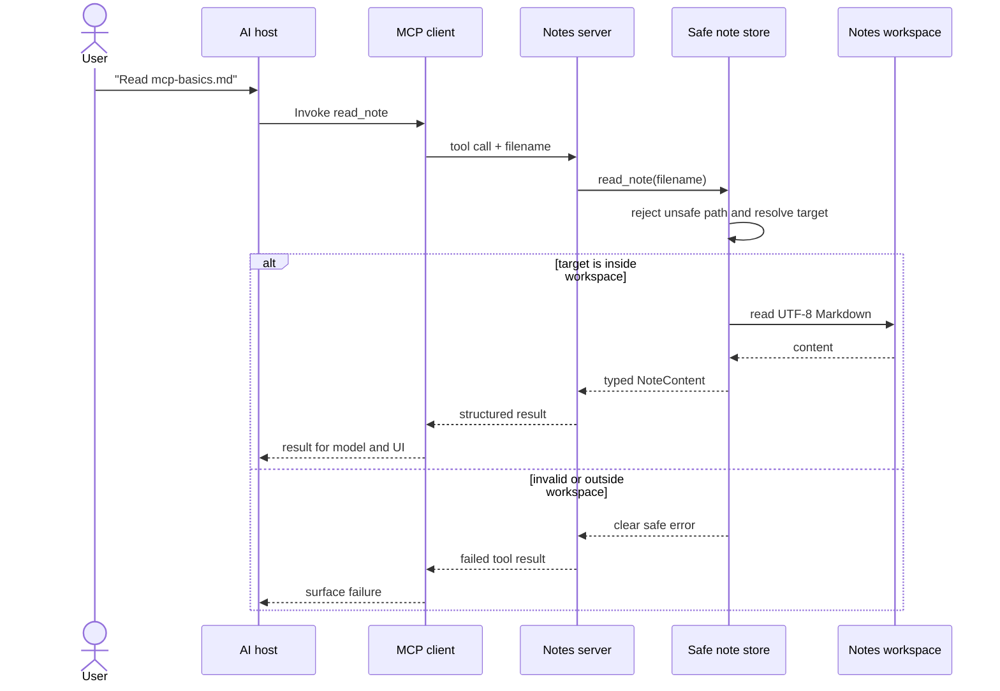

# Architecture

This project is deliberately split into protocol, application, and storage
layers. You can learn MCP without mixing protocol mechanics with filesystem
security.

## Host, client, and server

These names are easy to blur:

- The **MCP host** is the AI application the user interacts with. It owns the
  model, conversation, consent experience, and one or more clients.
- An **MCP client** is the host-side protocol connection to one server. It
  negotiates capabilities, discovers primitives, and sends invocations.
- The **MCP server** publishes tools, resources, and prompts. This project is a
  server. It does not contain an LLM and does not decide what the user meant.

For a local stdio connection, the host launches this process and exchanges MCP
messages through stdin and stdout. Human-readable logs must use stderr.

## Tool discovery

At startup, `server.py` registers Python functions with `FastMCP`. Their names,
docstrings, type annotations, and Pydantic return models become discoverable MCP
definitions. A client initializes the connection and requests the tool list. The
model can then reason over those descriptions, while the host remains responsible
for policy and approval.

Discovery does not grant unlimited filesystem access. Each call still enters the
same application and storage checks.

## Tool invocation

The tools are synchronous because local Markdown I/O is small and simple. A
larger store could use asynchronous I/O or a database without changing the MCP
contract.

## Notes workspace boundary

`MCP_NOTES_DIR` defines the authority of this process. `NoteStore` creates and
resolves that root once. Every caller-supplied filename is required to be a
relative, visible `.md` path. It is then resolved and proven to remain under the
root. This final containment check also handles symlinks.

The boundary is centralized in `_safe_path`. Tools do not construct their own
filesystem paths. Listing separately ignores symlinks and verifies every result.

## Data flow by layer

| Layer | Responsibility | Must not do |
|---|---|---|
| MCP transport | register capabilities, run stdio | make filesystem policy |
| `NoteTools` | application operations and audit-friendly logging | bypass store |
| `NoteStore` | validation, containment, Markdown I/O | know about MCP transport |
| Filesystem | persist local notes | define user intent |

Structured result models keep output predictable. Structured logs record the
operation and relative filename, not note content or search queries.

## Failure modes

- **Invalid configuration:** startup fails if `MCP_NOTES_DIR` is missing or the
  log level is invalid.
- **Unsafe path:** absolute, traversal, hidden, non-Markdown, and escaping
  symlink paths are rejected.
- **Missing note:** reads and appends return a specific not-found error.
- **Filename collision:** creation refuses to overwrite an existing slug.
- **Encoding or permission failure:** filesystem errors fail the tool call and
  appear in server logs.
- **Broken protocol:** printing logs to stdout can corrupt stdio, so all logs go
  to stderr.
- **Concurrent mutation:** two append operations may race. This project does not
  claim transactional writes.
- **Prompt injection in notes:** note text is untrusted data. Hosts must not treat
  instructions inside a note as trusted system instructions.

## Enterprise evolution

An enterprise version would usually replace a process-wide directory with an
identity-aware repository. Authentication establishes the caller; authorization
maps that caller to tenant, collection, document, and action. A policy engine
could require approval for mutations. Storage would add encryption, versioning,
locking, retention, malware scanning, and data classification.

Search would move to a permission-filtered index. Audit events would include
principal, request ID, policy decision, and outcome, while redacting document
content. Remote transport would require TLS, OAuth-compatible authorization,
rate limiting, origin validation, and careful session handling. Observability,
SLOs, dependency governance, and incident response would become part of the
system rather than a future note.

The MCP surface can remain recognizable through that evolution. The production
work is mostly about identity, policy, data lifecycle, and operations around it.
