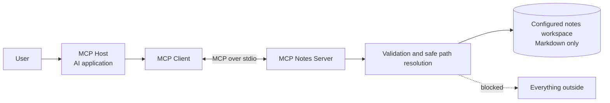

# MCP Notes Server

> A beginner-friendly, production-aware Model Context Protocol server for a
> local Markdown notes workspace.

Give an AI assistant useful access to a folder of Markdown notes without giving
it your whole hard drive.

[](https://www.python.org/)
[](https://github.com/modelcontextprotocol/python-sdk)
[](LICENSE)

## What this project is

This repository is a small, inspectable MCP server for local Markdown notes.
An MCP-compatible AI application can discover its tools, validate their inputs,
and invoke them over a standard protocol.

The server can:

- list notes
- read one note
- search notes
- create a safely named note
- append to an existing note
- expose a read-only note index as a resource
- provide a reusable `summarize_note` prompt

The important part is what it cannot do: access a file outside the configured
notes workspace.

## Why MCP exists

Without a protocol, every AI application and every tool provider needs a custom
integration. MCP standardizes the conversation: servers describe capabilities,
clients discover them, and hosts decide when and how the model may use them.

MCP is not magic and it is not the model itself. It is a contract around context
and actions. Permissions, validation, user intent, and operational security are
still your responsibility.

## Architecture



The host owns the user experience and model. Its MCP client connects to this
server. The server advertises tools, validates each request, and touches only the
configured directory. See [ARCHITECTURE.md](ARCHITECTURE.md) for the full model.

## Quick start

Prerequisites: Python 3.11+ and, optionally, [uv](https://docs.astral.sh/uv/).

```bash
git clone https://github.com/revanthpp/mcp-notes-server.git
cd mcp-notes-server

python -m venv .venv
source .venv/bin/activate
python -m pip install -e ".[dev]"

cp .env.example .env
export MCP_NOTES_DIR="$PWD/examples/sample_notes"
mcp-notes-server
```

The process waits for MCP messages on stdin. That quiet terminal is normal.
Logs go to stderr so they do not corrupt the stdio protocol.

With uv, the equivalent setup is:

```bash
uv sync --extra dev
MCP_NOTES_DIR="$PWD/examples/sample_notes" uv run mcp-notes-server
```

## Run the tests

```bash
pytest
ruff check .
```

The tests cover normal note workflows and attacks involving absolute paths,
`..` traversal, hidden files, non-Markdown files, and symlinks that point outside
the workspace.

## Connect an MCP-compatible client

Most local clients accept a command, arguments, and environment variables for a
stdio server. Use an absolute repository path:

```json
{
  "mcpServers": {
    "notes": {
      "command": "/absolute/path/to/mcp-notes-server/.venv/bin/mcp-notes-server",
      "args": [],
      "env": {
        "MCP_NOTES_DIR": "/absolute/path/to/mcp-notes-server/examples/sample_notes",
        "MCP_NOTES_LOG_LEVEL": "INFO"
      }
    }
  }
}
```

Configuration filenames and UI steps differ by client. Use its documentation,
restart or reconnect the client, then check that these five tools appear.

You can also inspect the server interactively:

```bash
MCP_NOTES_DIR="$PWD/examples/sample_notes" \
  npx -y @modelcontextprotocol/inspector \
  .venv/bin/mcp-notes-server
```

## Tools and schemas

| Capability | Input | Result |
|---|---|---|
| `list_notes` | none | titles and workspace-relative paths |
| `read_note` | `filename` | title, path, and Markdown content |
| `search_notes` | `query` | matching notes and short snippets |
| `create_note` | `title`, `content` | created path and status message |
| `append_to_note` | `filename`, `content` | updated path and status message |
| Resource `notes://index` | none | read-only JSON note index |
| Prompt `summarize_note` | `filename` | reusable summarization instruction |

Python type hints and Pydantic models become MCP input and output schemas through
the official SDK. This lets clients discover more than function names. They can
see the shape of a valid call before making one.

## Example tool calls

The wire format is handled by your MCP client, but the logical calls look like:

```json
{"name": "list_notes", "arguments": {}}
```

```json
{"name": "read_note", "arguments": {"filename": "mcp-basics.md"}}
```

```json
{
  "name": "create_note",
  "arguments": {
    "title": "My First MCP Note",
    "content": "The protocol connects hosts, clients, and servers."
  }
}
```

The last call creates `my-first-mcp-note.md`. It will not overwrite an existing
file with that name.

## The security boundary

Every user-supplied filename passes through the same resolver. It:

1. rejects empty and absolute paths
2. rejects any `..` component
3. rejects hidden paths and non-`.md` files
4. resolves symlinks and normalizes the target
5. proves the resolved target is still under the configured workspace

This is defense in depth, not a claim of perfect isolation. Run the process as a
low-privilege user and configure the smallest useful directory. Read the threat
model in [SECURITY.md](SECURITY.md).

## What can go wrong?

- A broadly configured workspace exposes more notes than intended.
- A model may invoke the wrong tool or append unwanted text.
- Sensitive content in a note can flow into model context or provider logs.
- Concurrent writes can interleave because this teaching project has no locking.
- Huge workspaces can make listing and searching slow.
- A remotely exposed server needs authentication, authorization, rate limits,
  transport security, and tenant isolation that this local stdio demo does not add.

The host should show tool activity and ask for confirmation before writes. The
server should still validate everything because model behavior is not a security
boundary.

## Production considerations

For a real deployment, add identity and per-user authorization, audit events with
redaction, file size and request limits, atomic writes and locking, pagination or
an index, encrypted storage, retention controls, telemetry, dependency scanning,
and explicit approval policies for mutations. Pin and regularly update the MCP
SDK. Keep local stdio and remote HTTP threat models separate.

The current dependency uses the maintained MCP Python SDK 1.x line and includes
an upper bound before the forthcoming 2.x breaking release. Upgrade deliberately
after reviewing its migration guide.

## Repository tour

```text
src/mcp_notes_server/
├── server.py          # MCP registration and stdio entry point
├── tools.py           # application-facing tool service
├── note_store.py      # filesystem boundary and note operations
├── schemas.py         # typed inputs and outputs
├── config.py          # environment configuration
└── logging_config.py  # structured stderr logging
```

`tests/` proves behavior and boundaries. `examples/` contains safe sample notes.
`diagrams/`, `articles/`, and `video-scripts/` turn the implementation into
reusable teaching material.

## Next steps

Try the sample workspace, connect your preferred MCP client, and inspect every
tool call. Then experiment with one improvement at a time: frontmatter metadata,
tags, an approval step for writes, or SQLite-backed search.

If you are learning, start with [ARCHITECTURE.md](ARCHITECTURE.md). If you are
deploying, start with [SECURITY.md](SECURITY.md). Contributions are welcome.

Created by [revanthpp](https://github.com/revanthpp) as part of a practical
beginner series on AI systems.
